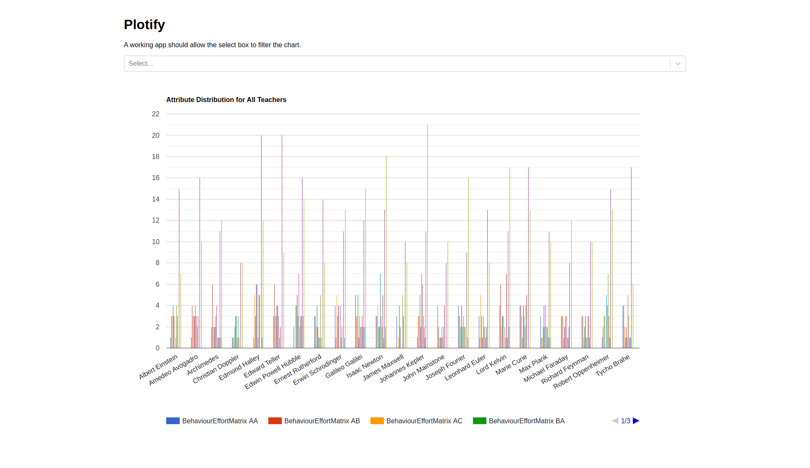
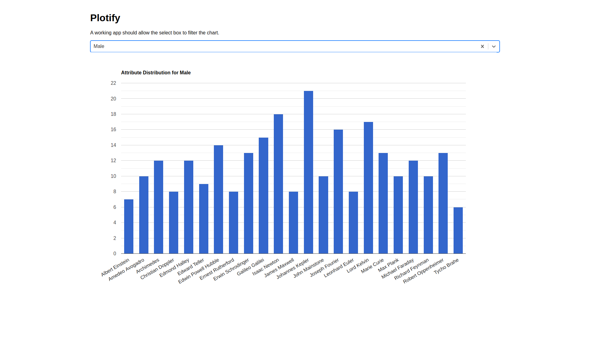

# Plotify - Polymathian Interview Task

An interview task created by Polymathian.

## License

Copyright 2020 Polymathian

License is given to use and modify this Work only for the purpose of applying for a position at Polymathian.
Redistribution and use in source and binary forms, with or without modification, are **not** permitted.
All Derivative Works become the intellectual property of Polymathian and must be provided to Polymathian.

THIS SOFTWARE IS PROVIDED BY THE COPYRIGHT HOLDERS "AS IS" AND ANY EXPRESS OR IMPLIED WARRANTIES, INCLUDING, BUT NOT LIMITED TO, THE IMPLIED WARRANTIES OF MERCHANTABILITY AND FITNESS FOR A PARTICULAR PURPOSE ARE DISCLAIMED. IN NO EVENT SHALL THE COPYRIGHT HOLDER OR CONTRIBUTORS BE LIABLE FOR ANY DIRECT, INDIRECT, INCIDENTAL, SPECIAL, EXEMPLARY, OR CONSEQUENTIAL DAMAGES (INCLUDING, BUT NOT LIMITED TO, PROCUREMENT OF SUBSTITUTE GOODS OR SERVICES; LOSS OF USE, DATA, OR PROFITS; OR BUSINESS INTERRUPTION) HOWEVER CAUSED AND ON ANY THEORY OF LIABILITY, WHETHER IN CONTRACT, STRICT LIABILITY, OR TORT (INCLUDING NEGLIGENCE OR OTHERWISE) ARISING IN ANY WAY OUT OF THE USE OF THIS SOFTWARE, EVEN IF ADVISED OF THE POSSIBILITY OF SUCH DAMAGE.

## Requirements
- Node & NPM
- Python 3.6 (may work in other versions, untested)
- A web browser

## Setup
1. Create a private fork of this repo
1. Install the required Python packages listed in `requirements.txt`
1. Build the JavaScript
    - Enter `plotify/static`
    - Run `npm install`
    - Run `npm run build`
1. Run `run.py`, your app will be available on `http://localhost:8080`

## Task
Plotify is a web application for data visualisation, specifically the distribution of students across teachers at a school.
A `class` has a single teacher and multiple `students`, each student has 0 or more `attributes`.
See the database section for a proper database definition.

There are two routes in `webapp.py` which need to be filled in, they involve fetching data from the database and returning it in the described format.
The docstrings of each function describe what the function needs to do.
**Your task is to fill in these functions.**

### Goal
The chart runs in two modes; `attribute`, and `all attributes`.
These attributes are selected from a dropdown, one of your routes populates this dropdown.

#### All Attributes

When no attribute is selected from the dropdown, the chart should show how many students each teacher has with each attribute, by teacher.

#### Attribute

When an attribute is selected from the dropdown, the chart should show how many students each teacher has with that specific attribute.

### Database Definition
    CREATE TABLE class(
        id INTEGER PRIMARY KEY,
        teacher_name TEXT UNIQUE NOT NULL
    );
    
    CREATE TABLE student(
        name TEXT PRIMARY KEY NOT NULL,
        class_id INT NOT NULL,
        FOREIGN KEY(class_id) REFERENCES class(id)
    );
    
    CREATE TABLE student_attribute(
        id INTEGER PRIMARY KEY,
        attribute TEXT NOT NULL,
        student_name TEXT NOT NULL,
        FOREIGN KEY(student_name) REFERENCES student(name),
        UNIQUE(student_name, attribute)
    )

### Some notes
- We will review your changes using `git diff`, so please try to avoid making unnecessary changes to the formatting of existing code
- Feel free to make any improvements or extensions to the app to show off your skills
- You will be assessed based on:
   - Completion of the task
   - Code quality, security, and maintainability
- The chart will look nicer if you set all the `chartArea` options to `100`
